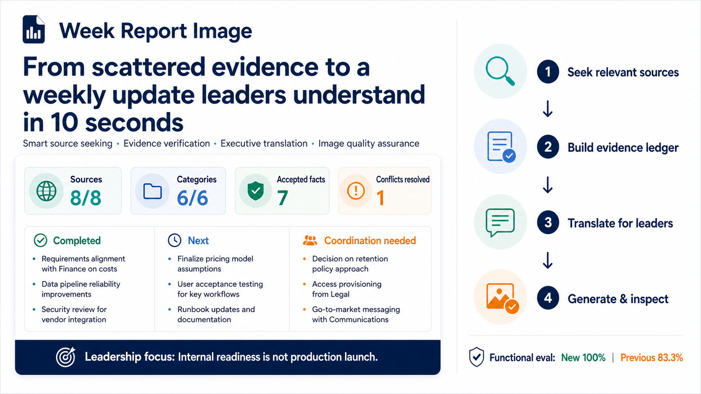
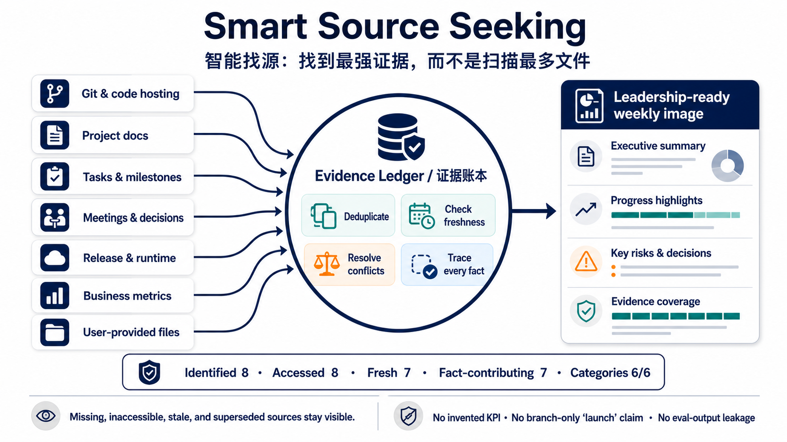

# Week Report Image

[中文](README.zh-CN.md) · [Install](#install) · [Functional evals](#functional-evals)

[](https://skills.sh/liush2yuxjtu/week-report-image)
[](https://github.com/liush2yuxjtu/week-report-image/actions/workflows/ci.yml)
[](LICENSE)



Turn scattered weekly evidence into one verified, leadership-ready 16:9 report image.

`week-report-image` seeks relevant sources, measures coverage, resolves conflicting evidence, translates implementation activity into business language, generates the final infographic with `imagegen`, and inspects the PNG before delivery.

## Why

Most weekly-report workflows fail in one of two ways:

- they summarize whichever file was easiest to find;
- they make a beautiful slide that overstates readiness or invents KPIs.

This skill treats source coverage and status truthfulness as part of image quality. “Implemented locally” is not “launched.” Missing, inaccessible, stale, and superseded evidence remains visible in the audit trail.

## Features

- **Smart Source Seeking** — covers Git/code hosting, project records, tasks, meetings, releases/runtime evidence, business metrics, and user-provided files.
- **Measured coverage** — records identified, accessed, fresh, and fact-contributing sources plus category coverage.
- **Evidence ledger** — deduplicates mirrors, checks freshness, resolves conflicts, and traces every accepted statement.
- **Executive translation** — produces completed, next, coordination, risk, milestone, and management-focus language for leaders.
- **No invented KPI** — uses status cards when reliable numbers do not exist.
- **Image quality gate** — generates one 16:9 PNG and inspects text, clipping, hierarchy, and status accuracy with Pi `read`.
- **Portable functional evals** — includes deterministic fixtures, source inventory smoke tests, missing-source checks, deduplication, and evaluation-leakage guards.

## Smart Source Seeking



The goal is not to scan the most files. It is to find the strongest independent evidence for each requested source category, then stop when every source is accessed, missing, inaccessible, irrelevant, or superseded.

A structured `source-coverage.json` records:

- source and category counts;
- freshness and access state;
- accepted facts and confidence;
- conflicts and conservative resolution;
- material limitations and fallback paths.

## Install

### skills.sh / universal CLI

```bash
npx skills add liush2yuxjtu/week-report-image
```

Install globally:

```bash
npx skills add liush2yuxjtu/week-report-image -g -y
```

### Pi

Clone or copy this repository into your Pi skills directory, or use the universal installer for the Pi-supported agent target.

## Usage

```text
/week-report-image
Collect the last seven days across our GitHub repo, project docs, task board,
meeting notes, release evidence, and sales metrics. Create one image for the
leadership team. Show completed work, next actions, risks, and decisions needed.
Do not invent missing KPIs.
```

Other prompts that should trigger it:

```text
Create a weekly progress image for leadership from all reachable project sources.
```

```text
把最近 7 天的项目、会议、任务和业务指标汇总成一张领导周报图。
```

## Output

Primary deliverable:

- one inspected 16:9 PNG generated through `imagegen`.

Audit sidecar when an output directory is supplied:

- `source-coverage.json` following [`references/source-ledger-schema.md`](references/source-ledger-schema.md).

The image stays executive-friendly; technical source coverage remains outside the slide.

## Functional evals

The repository includes two suites:

- [`evals/evals.json`](evals/evals.json) — end-to-end leadership image behavior;
- [`evals/functional-evals.json`](evals/functional-evals.json) — source breadth, missing-source disclosure, deduplication, stale-evidence handling, and no eval-output leakage.

Deterministic smoke test:

```bash
python3 scripts/create_functional_fixture.py /tmp/week-report-image-fixture
python3 scripts/source_inventory.py \
  --root /tmp/week-report-image-fixture \
  --term 星河 --term 试用 \
  --since-days 7 --max-depth 6 \
  --output /tmp/week-report-image-inventory.json
```

Latest measured results:

| Evaluation | Current skill | Comparison |
|---|---:|---:|
| 3 end-to-end scenarios, 17 assertions | 100% | No-skill baseline: 65.7% |
| Source-breadth iteration, 6 assertions | 100% | Previous skill: 83.3% |
| Deterministic inventory smoke | 7 sources | 1 Git repo, 6 files, 1 recent commit |

One run per configuration was used in the source-breadth iteration; these results prove the tested behavior, not broad statistical reliability.

## Requirements

- an agent with filesystem and Git access;
- relevant remote/task/document tools when those sources are requested;
- `imagegen` for PNG generation;
- Pi `read`, or an equivalent image inspection tool, for final QA;
- Python 3.10+ for bundled helper scripts.

## Privacy and safety

- No credentials, private URLs, or sensitive repository details belong in the image.
- The local inventory helper skips common secret filenames and bounded cache/system trees.
- The skill does not search unrelated private mail or chat merely to increase source count.
- Source counts deduplicate mirrors, repeated branches, and generated outputs.
- Inaccessible authoritative sources are disclosed rather than replaced silently.

## Repository layout

```text
SKILL.md
scripts/
  source_inventory.py
  create_functional_fixture.py
references/
  source-coverage.md
  source-ledger-schema.md
  image-quality.md
evals/
  evals.json
  functional-evals.json
assets/
```

## License

MIT. Maintained by [liush2yuxjtu](https://github.com/liush2yuxjtu).
