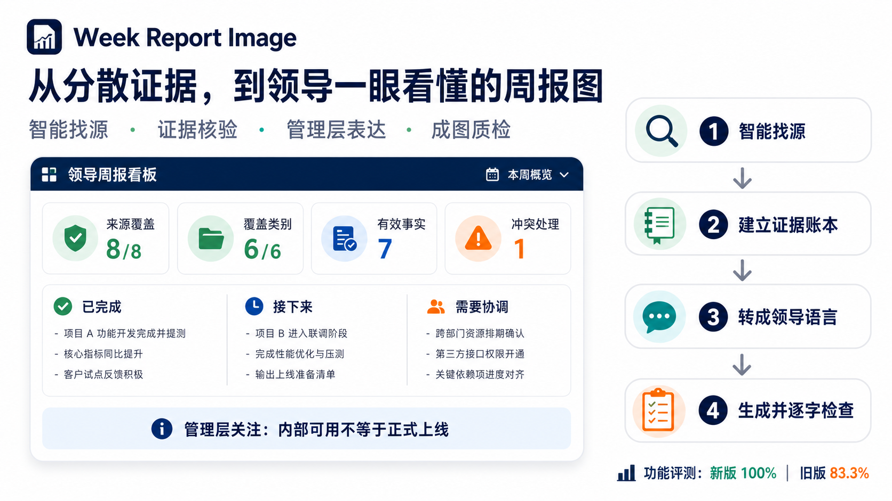

# Week Report Image

[English](README.md) · [安装](#安装) · [功能评测](#功能评测)

[](https://skills.sh/liush2yuxjtu/week-report-image)
[](https://github.com/liush2yuxjtu/week-report-image/actions/workflows/ci.yml)
[](LICENSE)



把过去一周分散在多个来源中的证据，变成一张经过核验、适合领导快速决策的 16:9 周报图。

`week-report-image` 会智能寻找相关来源、量化覆盖范围、处理证据冲突、把研发活动转成业务语言，通过 `imagegen` 生成最终图片，并在交付前检查 PNG。

## 为什么需要它

常见周报流程容易出现两个问题：

- 只总结最容易找到的文件，遗漏真正决定项目状态的证据；
- 图片很好看，但把“本地完成”写成“正式上线”，或为了版面编造 KPI。

本 Skill 把来源覆盖和状态真实性视为图片质量的一部分。缺失、不可访问、过期和已被替代的证据不会被悄悄隐藏。

## 核心能力

- **智能找源**：覆盖 Git/代码托管、项目记录、任务、会议、发布与运行证据、业务指标、用户文件。
- **覆盖可量化**：记录已识别、已访问、当前有效、贡献事实的来源数和类别覆盖。
- **证据账本**：去重镜像、检查新鲜度、解决冲突，并追踪每条最终结论。
- **领导语言**：聚焦已完成、接下来、需协调、风险、里程碑和管理层关注。
- **不编造 KPI**：缺少可靠数字时改用状态卡。
- **成图质检**：生成一张 16:9 PNG，并通过 Pi `read` 检查文字、裁切、层级和状态准确性。
- **可复现功能评测**：提供固定夹具、来源盘点、缺失披露、去重、旧证据处理和防评测泄漏测试。

## 智能找源


目标不是扫描最多文件，而是为每类用户要求找到最强、相互独立的证据。每个来源最终必须进入一种明确状态：已访问、缺失、不可访问、无关或已被更强证据替代。

结构化的 `source-coverage.json` 会记录：

- 来源数量与类别覆盖；
- 新鲜度与访问状态；
- 已接受事实及可信度；
- 冲突与保守处理结果；
- 关键缺口与后备路径。

## 安装

### skills.sh / 通用 CLI

```bash
npx skills add liush2yuxjtu/week-report-image
```

全局安装：

```bash
npx skills add liush2yuxjtu/week-report-image -g -y
```

### Pi

可把仓库复制到 Pi Skill 目录，也可使用上面的通用安装命令选择 Pi 支持的 Agent 目标。

## 使用示例

```text
/week-report-image
检查最近 7 天所有可访问的项目来源，包括 GitHub、项目文档、任务板、
会议纪要、发布证据和销售指标。生成一张给领导看的周报图，列出已完成、
下一步、风险和需要拍板的事情。没有可靠数字时不要编造 KPI。
```

其他触发示例：

```text
把最近 7 天的项目、会议、任务和业务指标汇总成一张领导周报图。
```

```text
Create a weekly progress image for leadership from all reachable project sources.
```

## 输出

主要交付物：

- 一张通过 `imagegen` 生成并完成检查的 16:9 PNG。

用户提供输出目录时，同时保存审计文件：

- `source-coverage.json`，结构见 [`references/source-ledger-schema.md`](references/source-ledger-schema.md)。

领导图片保持简洁，技术来源清单不会塞进图片。

## 功能评测

仓库包含两套评测：

- [`evals/evals.json`](evals/evals.json)：端到端领导周报图行为；
- [`evals/functional-evals.json`](evals/functional-evals.json)：来源广度、缺失披露、去重、旧证据处理和防评测输出泄漏。

确定性冒烟测试：

```bash
python3 scripts/create_functional_fixture.py /tmp/week-report-image-fixture
python3 scripts/source_inventory.py \
  --root /tmp/week-report-image-fixture \
  --term 星河 --term 试用 --term 试点 \
  --since-days 7 --max-depth 6 \
  --output /tmp/week-report-image-inventory.json
```

最新实测：

| 评测 | 当前 Skill | 对照 |
|---|---:|---:|
| 3 个端到端场景、17 条断言 | 100% | 无 Skill 基线：65.7% |
| 来源广度迭代、6 条断言 | 100% | 旧版 Skill：83.3% |
| 固定来源盘点冒烟测试 | 7 个来源 | 1 个 Git 仓库、6 个文件、1 条近期提交 |

来源广度迭代中，每种配置只运行一次；结果证明已测试功能，不代表大规模统计稳定性。

## 环境要求

- Agent 具备文件系统和 Git 访问能力；
- 请求远端任务、文档或指标时，具备对应工具；
- 使用 `imagegen` 生成 PNG；
- 使用 Pi `read` 或同等能力完成最终图片检查；
- 辅助脚本需要 Python 3.10+。

## 隐私与安全

- 图片不得包含凭据、私有 URL 或敏感仓库细节。
- 本地盘点脚本跳过常见凭据文件及缓存、系统目录。
- 不会为了增加来源数而搜索无关私人邮箱或聊天。
- 镜像仓库、重复分支和生成产物不会重复计数。
- 权威来源不可访问时会明确披露，不会偷偷用弱证据替代。

## 仓库结构

```text
SKILL.md
scripts/
  source_inventory.py
  create_functional_fixture.py
references/
  source-coverage.md
  source-ledger-schema.md
  image-quality.md
evals/
  evals.json
  functional-evals.json
assets/
```

## 许可证

MIT。维护者：[liush2yuxjtu](https://github.com/liush2yuxjtu)。
